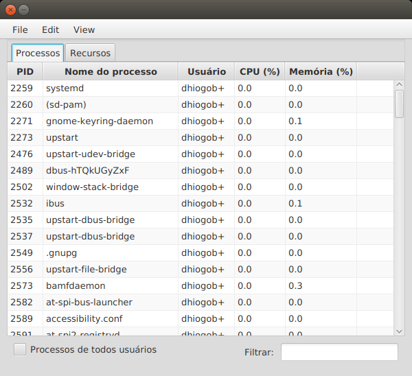
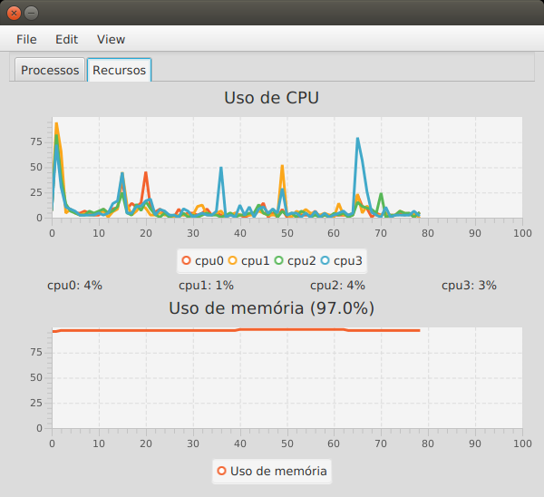

# Linux System Monitor - JavaFX

A sample system monitor for Linux using JavaFX.






## Requirements

- JDK
- javaFX: `sudo apt-get install openjfx`

## Compiling and Running

### Using ant
To compile and run this project type ./compile_run.sh in project root folder. Or to compile use:

```bash
ant -Dplatforms.JDK_1.8.home={YOUR_JAVA_HOME}
```

### Using gradle
Type:
```bash
./gradlew run
```

## Authors

* **Dhiogo Boza** - [dhiogoboza](https://github.com/dhiogoboza)


## License

This project is licensed under the [MIT License](https://opensource.org/licenses/MIT).
